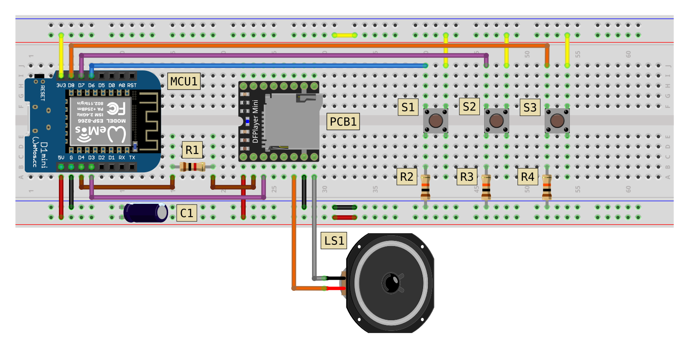

# MP3 Player

## Breadboard Circuit

## Component List

|Code|Description|
|:--|:--|
|MCU1|Wemos D1 Mini|
|PCB1|DFPlayer Mini|
|LS1|Speaker (1-3W)|
|C1|10V 220µF Electrolytic Capacitor|
|R1|1kΩ Resistor|
|R2|10kΩ Resistor|
|R3|10kΩ Resistor|
|R4|10kΩ Resistor|
|S1|Push-button|
|S2|Push-button|
|S3|Push-button|

## Libraries Used

1. [DFPlayer Mini Mp3 by Makuna](https://github.com/Makuna/DFMiniMp3)
